# 👋Readability-Controlled Sentence Simplification
This repository is used to reproduce the experimental results of
_**Let’s Simplify Step by Step: Guiding LLM Towards Multilingual few-shot Readability-Controlled Sentence Simplification**_, 
and meanwhile, it supplements the details that are not described clearly in the paper. I hope it can help and inspire you.

### 💡Research Framework
 

<br>

> **Abstract** 
> - **Motivation**: Large language models (LLMs) have shown promise in text simplification tasks that adapt content for different reading levels. **However, these models struggle when asked to make substantial adjustments in complexity**, particularly when simplifying from advanced to elementary reading levels (e.g., from CEFR level C2 to A1). 
> - **Methodology**: To address this challenge, we propose a novel framework that combines dynamic path planning with semantic-aware exemplar selection and Chain-of-Thought generation to break down complex simplification tasks. Our approach separates readability path planning from semantic preservation, enabling focused optimization of each objective. 

### 👇Content structure
> - [🥇0. Our main results](#our-main-results)
> - [1. Project Structure](#project-structure)
> - [2. Run Inference using DP-planner+CoT generation](#run-infer)
> - [3. Auto Evaluation](#auto-eval)


<h2 id="our-main-results">🥇0. Our main results:</h2>


> - The following are the heatmap displays of our model and the one-step LLM in terms of three metrics, namely _Adjacent Accuracy_, _Exact Accuracy_, and _RMSE_, on two benchmarks, CEFR-SP and README.  
> - We achieve up to **26\% improvement in adjacent accuracy while maintaining semantic fidelity**.


- _**CEFR-SP_Partial**_
<table style="width: 100%; border-collapse: collapse;">
  <tr>
    <td style="padding: 1px; width: 33.33%;">
      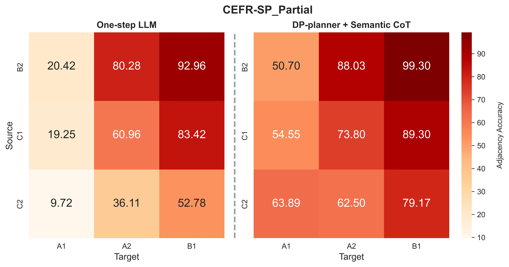
    </td>
    <td style="padding: 1px; width: 33.33%;">
      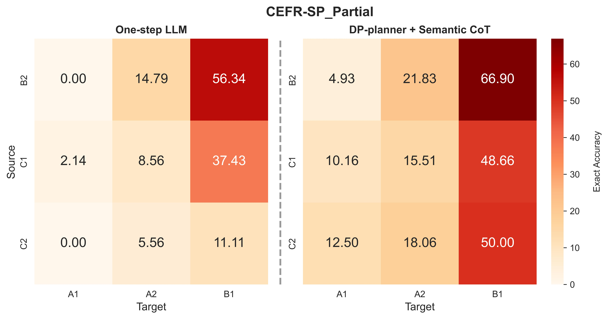
    </td>
    <td style="padding: 1px; width: 33.33%;">
      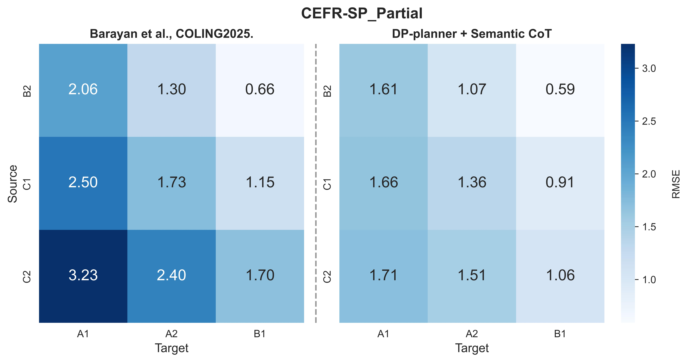
    </td>
  </tr>
</table>

- _**CEFR-SP_Whole**_
<table style="width: 100%; border-collapse: collapse;">
  <tr>
    <td style="padding: 1px; width: 33.33%;">
      
    </td>
    <td style="padding: 1px; width: 33.33%;">
      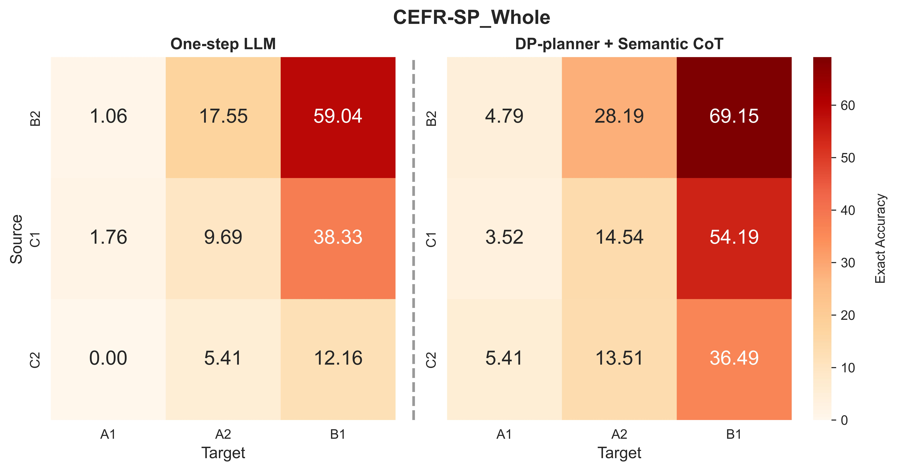
    </td>
    <td style="padding: 1px; width: 33.33%;">
      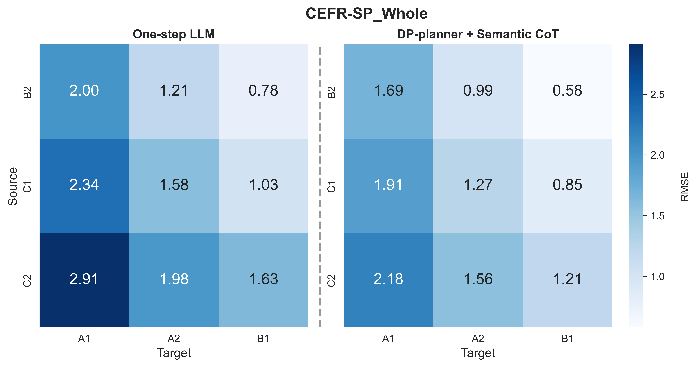
    </td>
  </tr>
</table>

- _**README_Arabic**_
<table style="width: 100%; border-collapse: collapse;">
  <tr>
    <td style="padding: 1px; width: 33.33%;">
      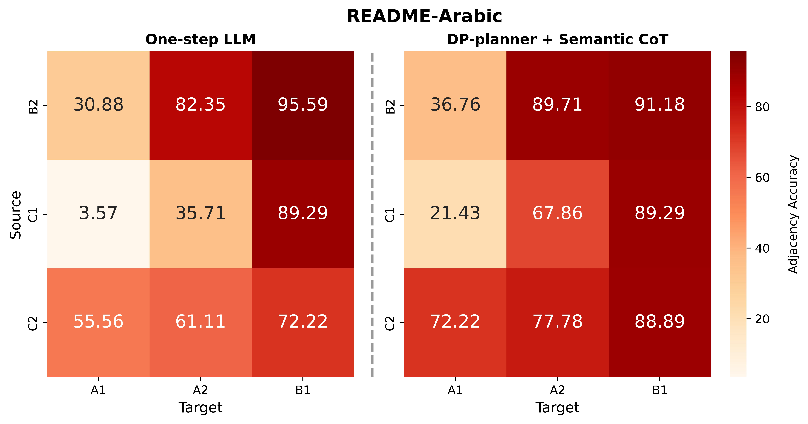
    </td>
    <td style="padding: 1px; width: 33.33%;">
      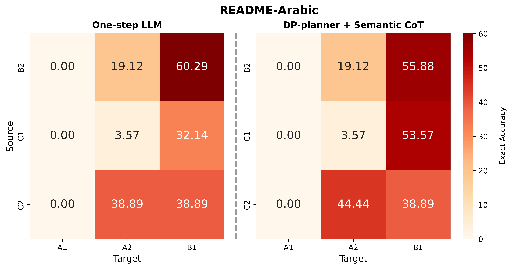
    </td>
    <td style="padding: 1px; width: 33.33%;">
      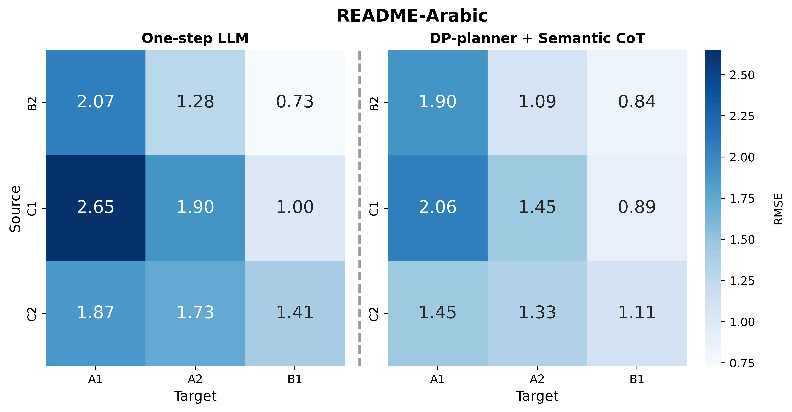
    </td>
  </tr>
</table>

- _**README_English**_
<table style="width: 100%; border-collapse: collapse;">
  <tr>
    <td style="padding: 1px; width: 33.33%;">
      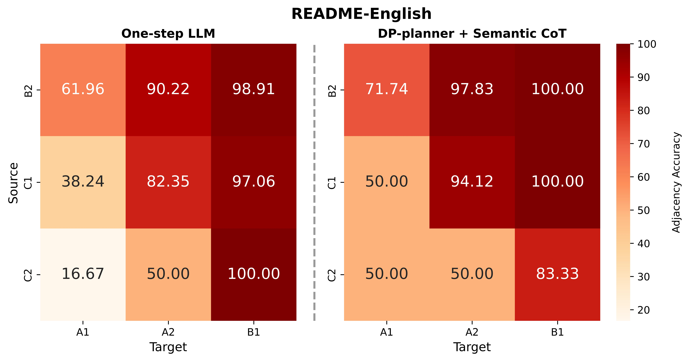
    </td>
    <td style="padding: 1px; width: 33.33%;">
      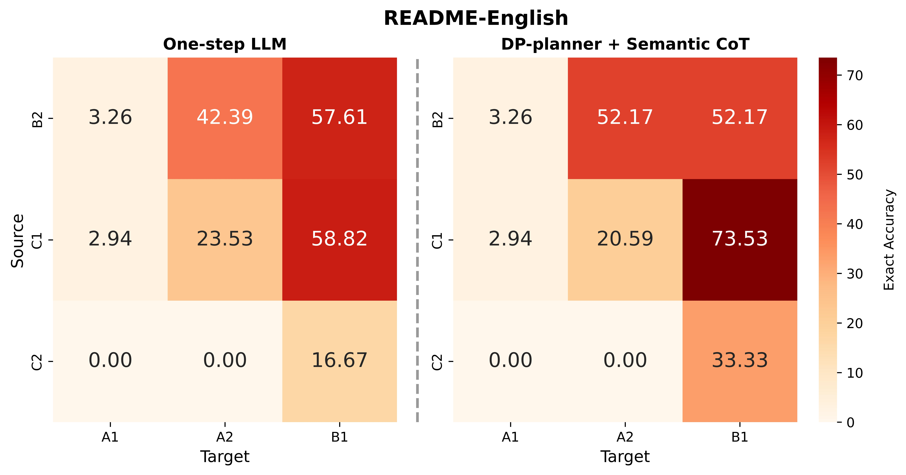
    </td>
    <td style="padding: 1px; width: 33.33%;">
      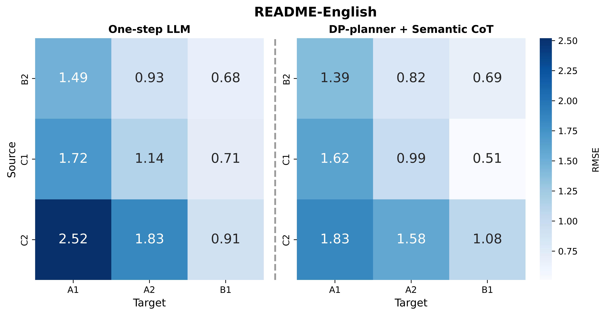
    </td>
  </tr>
</table>

- _**README_French**_
<table style="width: 100%; border-collapse: collapse;">
  <tr>
    <td style="padding: 1px; width: 33.33%;">
      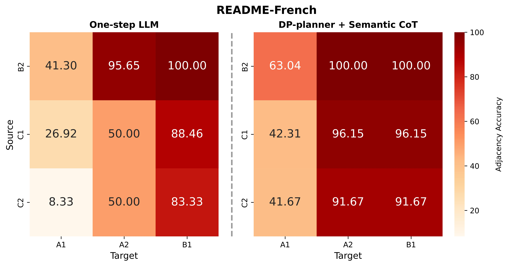
    </td>
    <td style="padding: 1px; width: 33.33%;">
      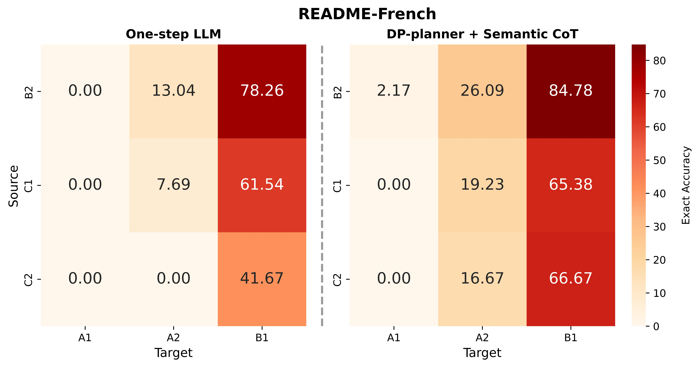
    </td>
    <td style="padding: 1px; width: 33.33%;">
      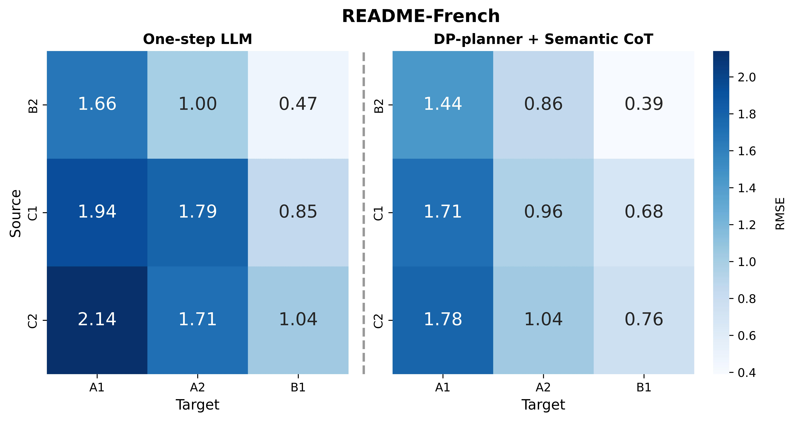
    </td>
  </tr>
</table>

- _**README_Hindi**_
<table style="width: 100%; border-collapse: collapse;">
  <tr>
    <td style="padding: 1px; width: 33.33%;">
      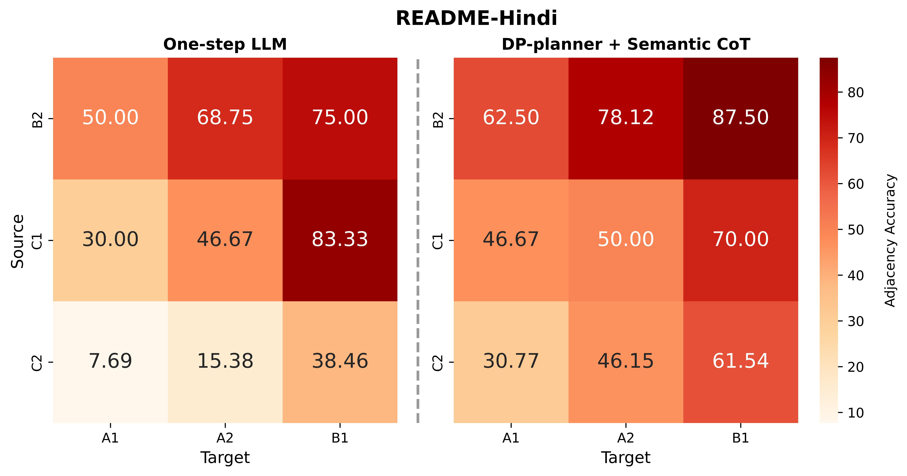
    </td>
    <td style="padding: 1px; width: 33.33%;">
      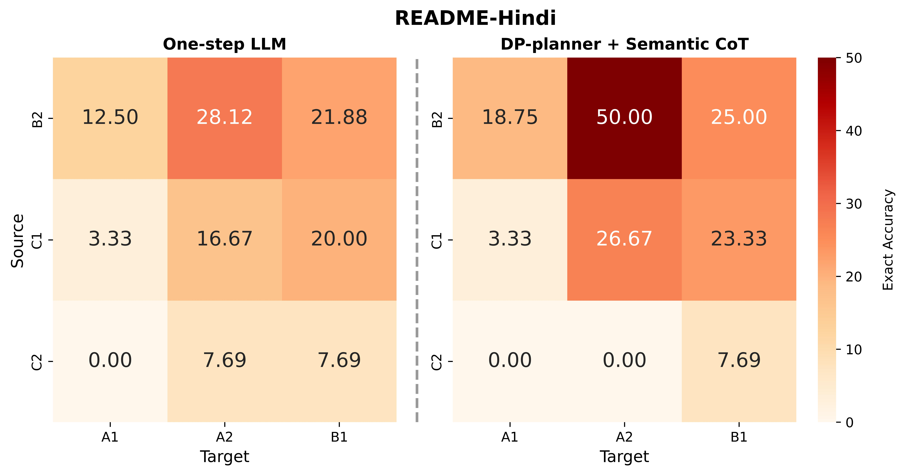
    </td>
    <td style="padding: 1px; width: 33.33%;">
      
    </td>
  </tr>
</table>

- _**README_Russian**_
<table style="width: 100%; border-collapse: collapse;">
  <tr>
    <td style="padding: 1px; width: 33.33%;">
      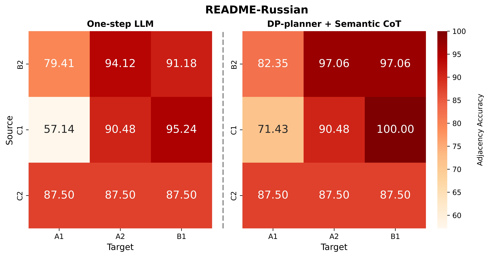
    </td>
    <td style="padding: 1px; width: 33.33%;">
      
    </td>
    <td style="padding: 1px; width: 33.33%;">
      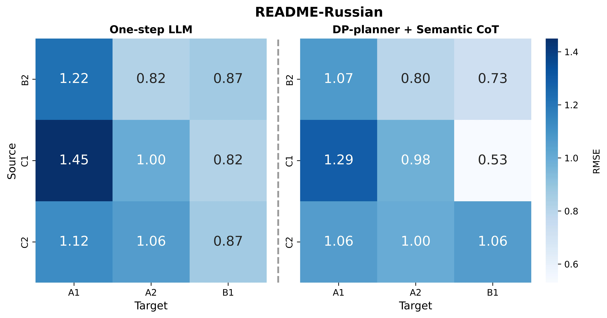
    </td>
  </tr>
</table>

<h2 id="project-structure">1. Project Structure</h2>

```
simplify-step-by-step
├─ data  # storing raw data which includes at least two columns named "Rating" and "Sentence". 
│  ├─ ar
│  ├─ en   # include CEFR-SP_partial
│  ├─ fr
│  ├─ hi
│  ├─ ru
│  ├─ prompt_expert  # Semantic prompt used in paper
├─ img   # visual auto-evaluation metric (Acc, RMSE) comparison between one-step LLM and our DP-planner+CoT
│  ├─ CEFR-SP
│  └─ README
│     ├─ ar
│     ├─ en
│     ├─ fr
│     ├─ hi
│     └─ ru
├─ README.md
├─ src
│  ├─ LLMGeneration  # llm generation for desired cefr-level
│  │  ├─ CEFR-SP
│  │  └─ README
│  │     ├─ ar
│  │     ├─ en
│  │     ├─ fr
│  │     ├─ hi
│  │     └─ ru
│  ├─ eval.py  # calculating seven metrics reported in paper
│  ├─ experiment_analysis.ipynb  # analysis llm generation, which mainly includes calculating ρ, adj_acc, exa_acc and rmse. 
│  ├─ cefr_estimator_choose.ipynb  # choosing optimal cefr-estimator for CEFR-SP corpus
│  ├─ llm_infer_zero-shot_dp-planner_CoT.py  # llm inference codes using policy planned by dp and CoT generation using semantic-aware exemplar selection
│  ├─ utils.py  # prompt description, dp-algorithm and other function code 
```
### Note: Newsela-Auto Portion in CEFR-SP

> Regarding the access permission, the Newsela annotated in CEFR-SP cannot be made publicly available. 
> - You should first obtain access of Newsela dataset (you can request an access [here](https://newsela.com/data/)). 
> - Please then contact the author of [CEFR-Based Sentence-Difficulty Annotation and Assessment](https://aclanthology.org/2022.emnlp-main.416/) for the Newsela-Auto portion of CEFR-SP with a certificate of your being granted Newsela-Auto access attached (a copy of e-mail communication with a Newsela contact person should be sufficient).

<h2 id="run-infer">2. Run Inference using DP-planner+CoT generation</h2>

```python
python src/llm_infer_zero-shot_dp-planner_CoT.py --infer_bs 5 --case_num 3 --model_name /path/to/Llama-3-8B-Instruct --save_dir zero-shot_cefrsp --corpus CEFR-SP
```
Note: The sentences simplified by the LLM will be saved in `src/LLMGeneration`. Among them, `llm_gene_CEFR1, llm_gene_CEFR2 and llm_gene_CEFR3` represent the generations specified for the `A1, A2 and B1` CEFR-levels. 


<h2 id="auto-eval">3. Auto Evaluation</h2>

```python
python src/eval.py --file_path LLMGeneration/CEFR-SP/en_few-shot_29.csv --lang en --STS_model all-MiniLM-L6-v2 --BS_model roberta-large --cola roberta-large-cola-krishna2020
```
Note: As for using CEFR-SP predictor to assess CEFR-level, we utilize the script in _CEFR-Based Sentence-Difficulty Annotation and Assessment_. [🔗Link](https://github.com/yukiar/CEFR-SP)

Download links and references of the estimator model checkpoints used in the paper are listed as follows: 

| 🖊Model               | 🔗Link                                         | 📚Reference                      |
|-----------------------|------------------------------------------------|----------------------------------|
| CEFR-SP               | https://zenodo.org/records/7234096             | https://arxiv.org/abs/2210.11766 |
| README_English        | https://huggingface.co/tareknaous/readabert-en | https://arxiv.org/abs/2305.14463 |
| README_Arabic         | https://huggingface.co/tareknaous/readabert-ar | https://arxiv.org/abs/2305.14463 |
| README_Hindi          | https://huggingface.co/tareknaous/readabert-hi | https://arxiv.org/abs/2305.14463 |
| README_French         | https://huggingface.co/tareknaous/readabert-fr | https://arxiv.org/abs/2305.14463 |
| README_Russian        | https://huggingface.co/tareknaous/readabert-ru | https://arxiv.org/abs/2305.14463 |
| STS_English           | https://huggingface.co/sentence-transformers/all-MiniLM-L6-v2                                            | https://arxiv.org/abs/1908.10084                              |
| STS_non-English       | https://huggingface.co/sentence-transformers/paraphrase-multilingual-MiniLM-L12-v2                                            | https://arxiv.org/abs/1908.10084                              |
| BertScore_English     | https://huggingface.co/FacebookAI/roberta-large                                            | http://arxiv.org/abs/1907.11692                              |
| BertScore_non-English | https://huggingface.co/FacebookAI/xlm-roberta-large                                            | http://arxiv.org/abs/1911.02116                              |
| Cola_English          | https://drive.google.com/drive/folders/12ImHH2kJKw1Vs3rDUSRytP3DZYcHdsZw                                            | https://arxiv.org/abs/2010.05700                              |


